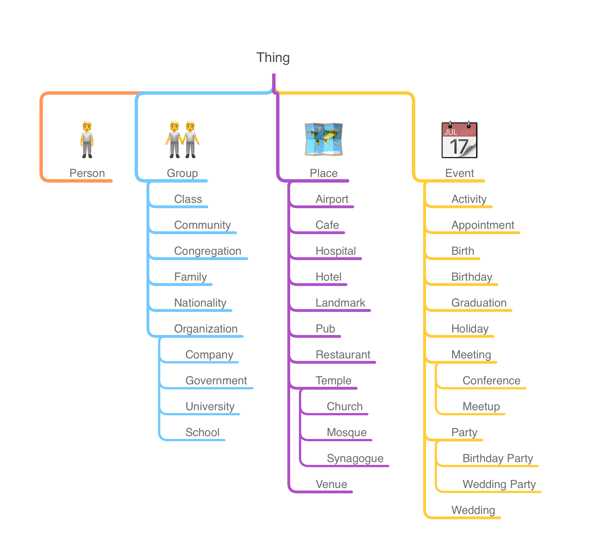

# The KNOW Ontology

## Paper

[KNOW: A Real-World Ontology for Knowledge Capture with Large Language Models](https://arxiv.org/abs/2405.19877)

We present KNOW--the Knowledge Navigator Ontology for the World--the first
ontology designed to capture everyday knowledge to augment large language
models (LLMs) in real-world generative AI use cases such as personal AI
assistants. Our domain is human life, both its everyday concerns and its
major milestones. We have limited the initial scope of the modeled concepts
to only established human universals: spacetime (places, events) plus social
(people, groups, organizations). The inclusion criteria for modeled concepts
are pragmatic, beginning with universality and utility. We compare and
contrast previous work such as Schema.org and Cyc--as well as attempts at a
synthesis of knowledge graphs and language models--noting how LLMs already
encode internally much of the commonsense tacit knowledge that took decades
to capture in the Cyc project. We also make available code-generated
software libraries for the 12 most popular programming languages, enabling
the direct use of ontology concepts in software engineering. We emphasize
simplicity and developer experience in promoting AI interoperability.

## Downloads

- [Turtle](https://github.com/KnowOntology/know-ontology/releases/download/0.1.0/know.rdf)
- [RDF/XML](https://github.com/KnowOntology/know-ontology/releases/download/0.1.0/know.ttl)
- [N-Triples](https://github.com/KnowOntology/know-ontology/releases/download/0.1.0/know.nt)
- [N-Quads](https://github.com/KnowOntology/know-ontology/releases/download/0.1.0/know.nq)

## Classes

